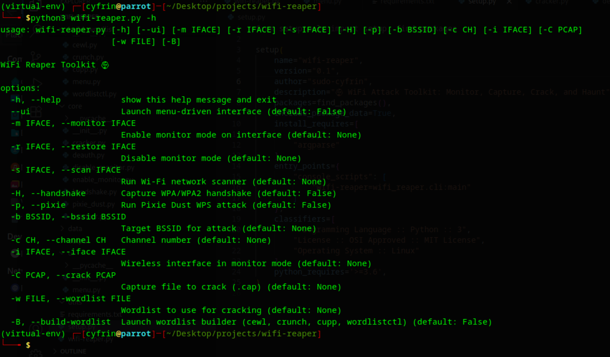

# WiFi Reaper Toolkit

An advanced modular wireless attack framework for Wi-Fi security testing and penetration testing.

Easily automate monitor mode, scanning, handshake capture, cracking, WPS (Pixie Dust) attacks, and wordlist building — all from one place.

---

### 📁 Project Structure

| Folder/File | Description |
| --- | --- |
| `core/` | Main modules (scanner, handshake, pixie-dust, cracker, etc.) |
| `build_wordlist/` | Tools for generating custom wordlists (`cewl`, `crunch`, `cupp`, `wordlistctl`) |
| `ui/` | Optional menu-driven UI |
| `output/` | Stores attack results and logs |
| `data/` | Stores temporary or internal data |
| `wifi-reaper.py` | Main CLI script |
| `requirements.txt` | Python dependencies |

---

### ⚙️ Features

- ✅ Monitor mode enable/disable
- ✅ Wi-Fi network scanner (via Scapy)
- ✅ WPA handshake capture with auto deauth
- ✅ Pixie Dust WPS attack (using bully)
- ✅ Crack handshakes using `hashcat`
- ✅ Build custom wordlists with:
    - 🛠️ `cewl`
    - 🛠️ `crunch`
    - 🛠️ `cupp`
    - 🛠️ `wordlistctl`
- ✅ Optional menu-based UI (`-ui`)

---
## 🚀 Installation

```bash
# 1. Clone the repository
git clone https://github.com/sudo-cyfrin/wifi-reaper.git
cd wifi-reaper
pip install -r requirements.txt
```

> ✅ Note: Some features require aircrack-ng, bully, or hashcat to be installed on your system (use your package manager like apt, brew, etc.).
> 

---

### 🧑‍💻 Usage (CLI)

```bash
python3 wifi-reaper.py --help

```



| Option | Description |
| --- | --- |
| `-m`, `--monitor` | Enable monitor mode |
| `-r`, `--restore` | Disable monitor mode |
| `-s`, `--scan` | Scan nearby Wi-Fi |
| `-H`, `--handshake` | Capture WPA handshake |
| `-p`, `--pixie` | Run Pixie Dust attack |
| `-C`, `--crack` | Crack handshake (.pcap) |
| `-w`, `--wordlist` | Provide wordlist |
| `-B`, `--build-wordlist` | Launch wordlist builder |
| `--ui` | Launch menu-based UI |

---

🧾 Example Commands

```
# Wordlist Builder
python3 wifi-reaper.py -B
```


```
# Pixie Dust WPS attack
python3 wifi-reaper.py -p -b <BSSID> -i wlan0mon
```

```
python3 wifi-reaper.py --ui
```


---

### 🛠 Requirements

Install dependencies:

```bash
pip install -r requirements.txt

```

**External tools needed**:

- `aircrack-ng`
- `hashcat`
- `bully`
- `hcxpcapngtool`
- `cewl`, `crunch`, `cupp`, `wordlistctl`

---

### ⚠️ Disclaimer

> This tool is for educational and authorized penetration testing purposes only.
> 
> 
> Do not use against networks without **explicit permission**.
> 

---